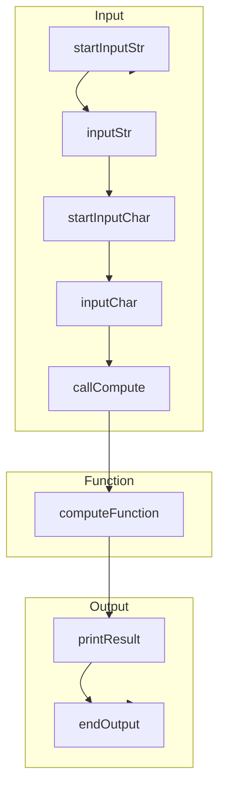

# 806

```mermaid
graph TD
    subgraph Input
        startInputStr --> inputStr
        inputStr --> startInputChar
        startInputChar --> inputChar
        inputChar --> callCompute
    end

    subgraph Function
        callCompute --> computeFunction
    end

    subgraph Output
        computeFunction --> printResult
        printResult --> endOutput
    end

    startInputStr --> Input
    endOutput --> Output

```