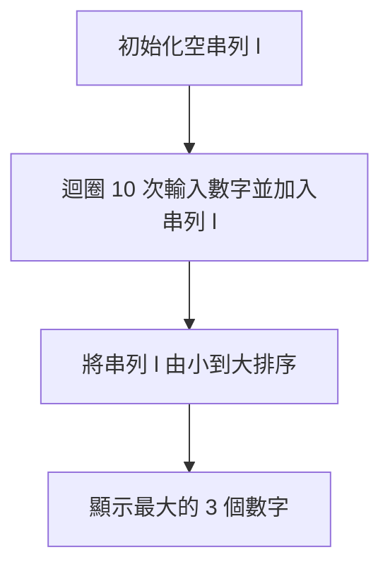

#603

請撰寫一程式，要求使用者輸入十個數字並存放在串列中。接著由大到小的順序顯示最大的3個數字。


```mermaid

graph TD
  A[初始化空串列 l]
  B[迴圈 10 次輸入數字並加入串列 l]
  C[將串列 l 由小到大排序]
  D[顯示最大的 3 個數字]

  A --> B
  B --> C
  C --> D

```


```python
l = []
for i in range(10):
  l.append(eval(input()))
l.sort()
print(l[-1], l[-2], l[-3])
```