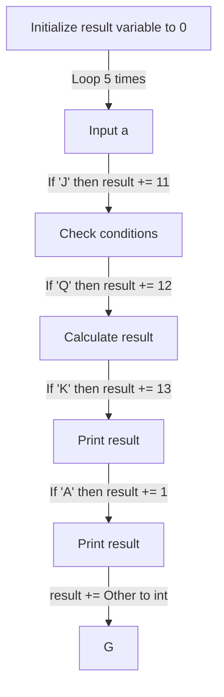

# Python 602

```mermaid
graph TD
    A[Initialize result variable to 0] -->|Loop 5 times| B[Input a]
    B -->|If 'J' then result += 11| C[Check conditions]
    C -->|If 'Q' then result += 12| D[Calculate result]
    D -->|If 'K' then result += 13| E[Print result]
    E -->|If 'A' then result += 1| F[Print result]
    F --> | result += Other to int | G
```