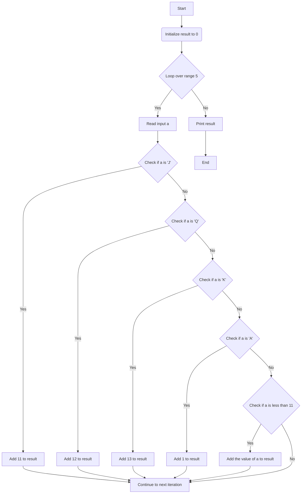

# 602

```mermaid
graph TD
  A[Start] --> B(Initialize result to 0)
  B --> C{Loop over range 5}
  C -->|Yes| D[Read input a]
  D --> E{Check if a is 'J'}
  E -->|Yes| F[Add 11 to result]
  F --> G[Continue to next iteration]
  E -->|No| H{Check if a is 'Q'}
  H -->|Yes| I[Add 12 to result]
  I --> G
  H -->|No| J{Check if a is 'K'}
  J -->|Yes| K[Add 13 to result]
  K --> G
  J -->|No| L{Check if a is 'A'}
  L -->|Yes| M[Add 1 to result]
  M --> G
  L -->|No| N{Check if a is less than 11}
  N -->|Yes| O[Add the value of a to result]
  O --> G
  N -->|No| G
  C -->|No| P[Print result]
  P --> Q[End]


```
